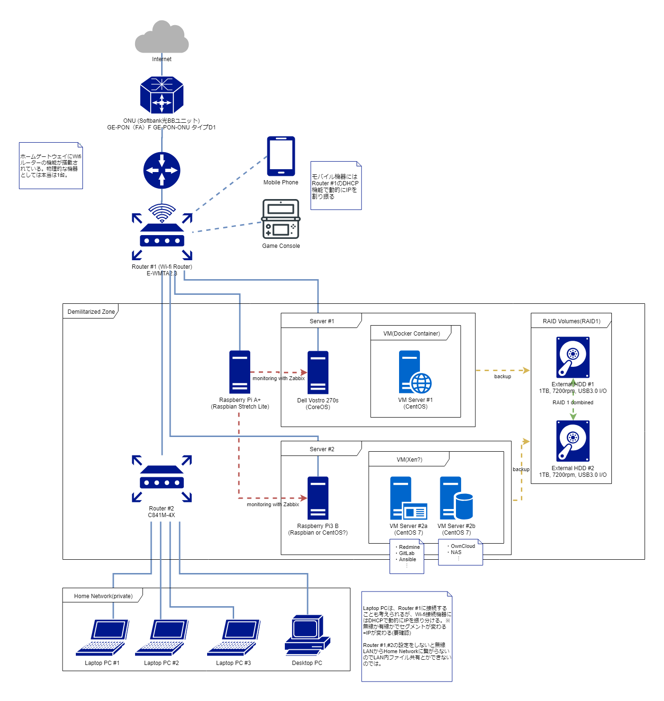
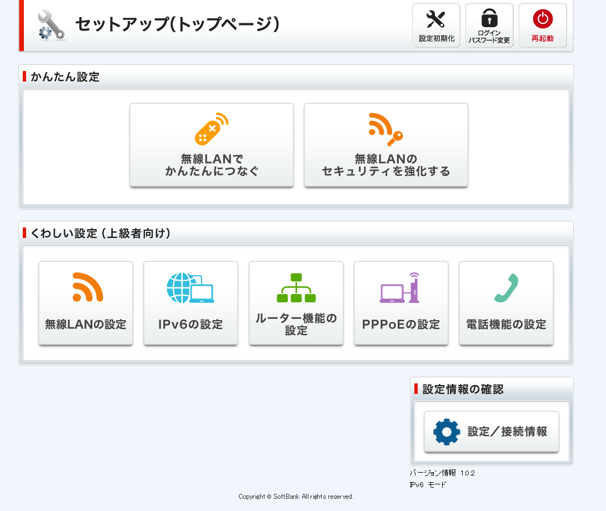
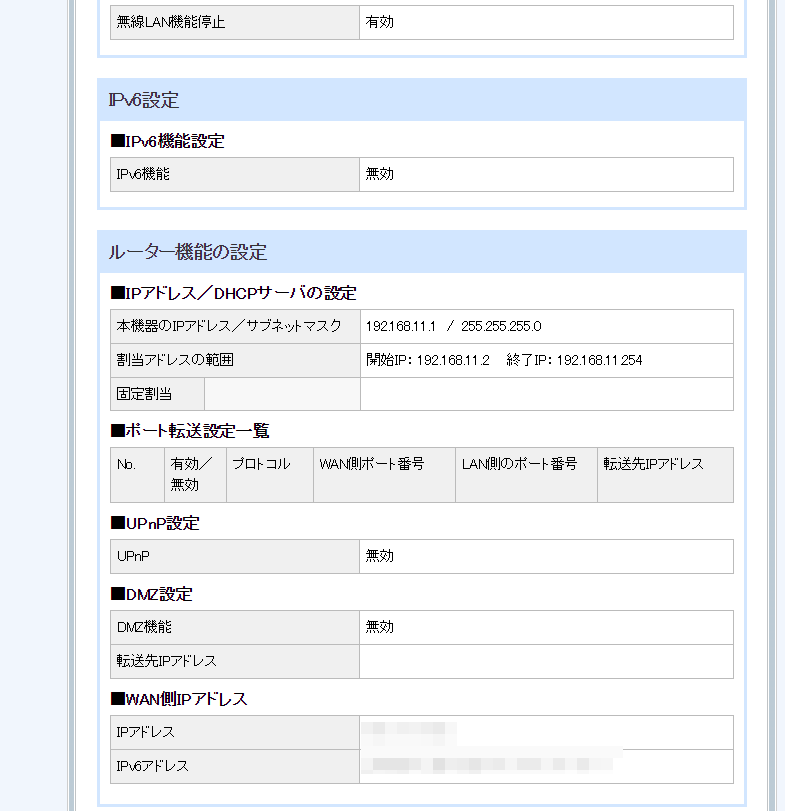
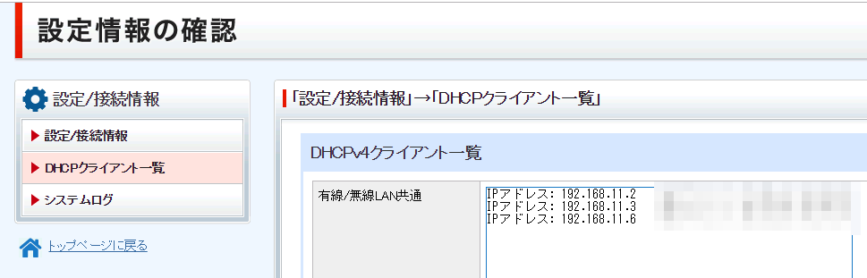
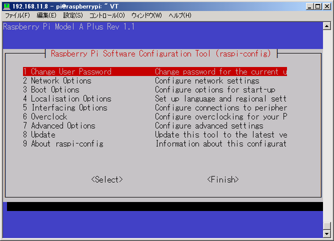
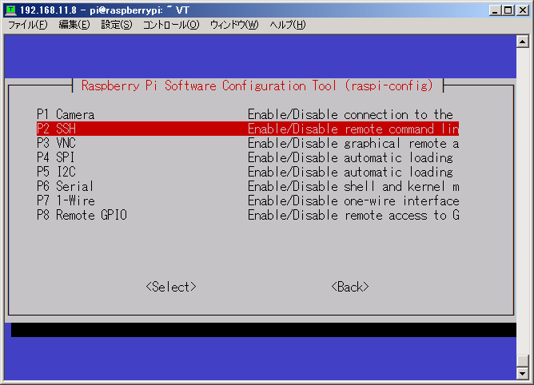

# 作ろうとしてるもの

 

# 環境

* ONU
  * Softbank光BBユニット
* ホームゲートウェイ
  * Router #1
    * Foxconn WMTA-2.3(E-WMTA2.3)
      * Wi-fiルーター機能付き
* ルーター
  * Router #2
    * Cisco C841M
* サーバーマシン
  * Server #1
    * RaspberryPi Model A+
      * Zabbixで下の#2,3を監視する専用のマシン
        * スペック足りてる？
  * Server #2
    * RaspberryPi3 Model B+
      * 自分用の外から見れるツール用
        * 一度立てたらソフトの構成をそうそう変えないだろうからこれで
          * スペック足りてる？？
  * Server #3
    * Dell Vostro 270s
      * 外部向けの公開用Webサーバー
        * 用途が決まっちゃいないのにこの中では一番スペックが高い謎
* 外付けHDD
  * 2台でRAID1組んでServer#1,2,3のバックアップ用に

## LAN周りの設定

ここまでの設定で、  

* 外からはDMZのマシン(今はルーターのみ)にアクセスできる

* 中からはDMZのマシンとインターネットにアクセスできる

  * 中からWi-fiで接続した場合はルーター#1のセグメントでIPが割り振られる

### ルーター#1：WAN側IPアドレスの設定

ルーター初期設定を確認して接続。デフォルト値は以下の通り。  

|IPアドレス|ユーザー名|パスワード|
|:--|:--|:--|
|http://172.16.255.254|user|user|

この時、パスワードは変更すること推奨。  
~~ユーザー名は変えられないのがいやん~~

トップページから「設定/接続情報」の「設定情報一覧」を選択。  
下にスクロールして「■WAN側IPアドレス」を確認。  





まずこのWAN側IPアドレス(以下グローバルIP)に対して外から繋げられるかを試す。  
今回はふつうにスマホを使った。  

何も設定していないので、
グローバルIPに繋いでもアクセスできない。

ルーター#2のWANポート(GIG4か5)にルーター#1のLANポートを繋いで、 
ルーター#2のMACアドレス(筐体下のラベルに書いてある)を入力。

ルーター#1のトップページから「ルーター機能の設定」の「IPアドレス/DHCPサーバの設定」で、  
ルーター#2に固定IPを割り振る(今回は102.168.11.11)

ルーター#1のトップページから「ルーター機能の設定」の「DMZの設定」で、  
ルーター#2の固定IPをDMZに割り振る。


## 物理マシンの設定

### RaspberryPi Model A+

* OS: Raspbian Stretch Lite  

    Version:November 2018  
    Release date:2018-11-13  
    Kernel version:4.14  
    Release notes:Link  

* ストレージ: microSD 16GB (class10)

https://www.raspberrypi.org/downloads/raspbian/

インストールはWindows機にアダプタで繋いだmicroSDに、  
SDフォーマッターしてからWin32DiskImagerで書き込むいつもの流れ。


## 物理マシンの設定

### RaspberryPi Model A+

* OS: Raspbian Stretch Lite  

    Version:November 2018  
    Release date:2018-11-13  
    Kernel version:4.14  
    Release notes:Link  

* ストレージ: microSD 16GB (class10)

https://www.raspberrypi.org/downloads/raspbian/

インストールはWindows機にアダプタで繋いだmicroSDに、  
SDフォーマッターしてからWin32DiskImagerで書き込むいつもの流れ。

#### インストール直後の下準備

SSHを有効化するまでは適当なディスプレイと  
USBハブにLANとマウス、キーボードをつないで操作する。  

IPアドレスも現段階では特に設定せずに  
Router #1のLANポートに繋いで割り振られたIPを使う。  
DHCPクライアントを表示する機能を使うと便利。  



###### ファームウェアの更新

出力は省略。  
適宜Y(Yes)を入力すること。

結構時間かかる。

```shell
$ sudo apt-get update
$ sudo apt-get upgrade
$ sudo apt-get dist-upgrade

$ uname -a
Linux raspberrypi 4.14.50+ #1122 Tue Jun 19 12:21:21 BST 2018 armv6l GNU/Linux

$ vcgencmd version
Jun  7 2018 15:31:38
Copyright (c) 2012 Broadcom
version 4800f08a139d6ca1c5ecbee345ea6682e2160881 (clean) (release)

$ sudo rpi-update
$ sudo reboot

$ uname -a
Linux raspberrypi 4.14.97+ #1197 Mon Feb 4 21:00:28 GMT 2019 armv6l GNU/Linux
$ vcgencmd version
Jan 22 2019 16:50:58
Copyright (c) 2012 Broadcom
version 7bfabcecab2918f85a2a217b389e256eac696962 (clean) (release) (start)
```

##### SSHの有効化

```shell
$ sudo raspi-config
```



ここの *"5 Interfacing Options"* から、  
*"P2 SSH"* を選び続く確認画面で "Yes" しておく。



これでSSH接続ができるようになる。
ログインユーザ名とパスワードは、  
``` pi ``` と ``` raspberry ``` 。

###### 不要なソフトと設定ファイルの削除

Minibianを直接入れられたらよかったんだけど、  
更新が2016年で止まってしまってるのが気になるので  
最新のRaspianから手作業で掃除することにした。  
(多いので節を分割)

* Wolfram、mathematica、Scratch、LibreOfficeの削除

```shell
$ sudo apt-get purge wolfram-engine
$ sudo apt-get autoremove wolfram-engine
$ sudo apt-get purge sonic-pi
$ sudo apt-get purge scratch
$ sudo apt-get autoremove scratch
$ sudo apt-get remove --purge libreoffice*
$ sudo apt-get clean
$ sudo apt-get autoremove
```

scratchとwolfram-engineについては ```apt-get purge``` しても削除対象のファイルが残っているので、  
追加で ```apt-get autoremove``` している。

* Minecraft、Python Games、IDLE、ブラウザの削除

```shell
$ sudo apt-get autoremove -y python-pygame
$ rm -rf /home/pi/python_games/
$ sudo rmdir /usr/local/games/
$ sudo rmdir /usr/games/
$ sudo apt-get autoremove -y pistore
$ sudo apt-get autoremove -y python-minecraftpi
$ sudo apt-get autoremove -y idle idle3
$ sudo apt-get autoremove -y netsurf-common dillo
$ sudo apt-get autoremove -y debian-reference-common
$ sudo apt-get autoremove -y libraspberrypi-doc
$ sudo apt-get autoremove -y galculator
$ sudo apt-get clean
$ sudo apt-get autoremove
```

##### 参考資料

Raspberry Pi 不要パッケージの削除
https://qiita.com/NaotakaSaito/items/f6e1ae206963b971028e

不要になったパッケージを削除してくれる、autoremove
http://wadap.hatenablog.com/entry/20080109/1199891111

### RaspberryPi3 Model B

* OS:CentOS 7.6 armhfp(Arm32) Minimal image for RaspberryPi 2/3
* ストレージ: microSD 32GB (class10)

http://isoredirect.centos.org/altarch/7/isos/armhfp/CentOS-Userland-7-armv7hl-RaspberryPI-Minimal-1810-sda.raw.xz

https://wiki.centos.org/SpecialInterestGroup/AltArch/armhfp

こちらも落としてきた.raw.xzファイルを  
WSLで ``` $ xz -d CentOS-Userland-7-armv7hl-RaspberryPI-Minimal-1810-sda.raw.xz ``` して解凍された.rawファイルをフォーマットしたmicroSDにWin32DiskImagerで書き込めばOK。 

ログインユーザ名とパスワードは、  
``` root ``` と ``` centos ``` 。

SDカードの容量に対してパーティションサイズが少なく認識されているのを直す。  

```shell
# df -h
Filesystem      Size  Used Avail Use% Mounted on
/dev/root       1.4G  896M  451M  67% /
devtmpfs        460M     0  460M   0% /dev
tmpfs           464M     0  464M   0% /dev/shm
tmpfs           464M   12M  452M   3% /run
tmpfs           464M     0  464M   0% /sys/fs/cgroup
/dev/mmcblk0p1  667M   38M  629M   6% /boot
tmpfs            93M     0   93M   0% /run/user/0
```
```shell
# cat /root/README
== CentOS 7 userland ==

If you want to automatically resize your / partition, just type the following (as root user):
rootfs-expand
```

```shell
# rootfs-expand
# df -h
Filesystem      Size  Used Avail Use% Mounted on
/dev/root        28G  899M   28G   4% /
devtmpfs        460M     0  460M   0% /dev
tmpfs           464M     0  464M   0% /dev/shm
tmpfs           464M   13M  452M   3% /run
tmpfs           464M     0  464M   0% /sys/fs/cgroup
/dev/mmcblk0p1  667M   38M  629M   6% /boot
tmpfs            93M     0   93M   0% /run/user/0
```

```shel
# uname -a
Linux localhost 4.14.82-v7.1.el7 #1 SMP Sun Nov 25 22:42:27 UTC 2018 armv7l armv7l armv7l GNU/Linux
# vcgencmd version
Nov  4 2018 16:31:07
Copyright (c) 2012 Broadcom
version ed5baf9520a3c4ca82ba38594b898f0c0446da66 (clean) (release)

# yum update

# uname -a
Linux localhost 4.14.91-v7.1.el7 #1 SMP Sun Jan 6 12:24:04 UTC 2019 armv7l armv7l armv7l GNU/Linux
# vcgencmd version
Dec 17 2018 23:56:39
Copyright (c) 2012 Broadcom
version da468960fe03ecbaa8e3f1ee01c7217c3bd01fa8 (clean) (release)
```

### 両マシン共通

電源オンオフが判断しにくいので、  
```/boot/config.txt``` を編集して対処する。  
CentOSには元からファイルが存在しないので新しく作成する。  
ファイルの編集が終わったら ```$ sudo reboot``` しておく。

```shell:/boot/config.txt
# 電源オン=点滅、電源オフ=点灯
dtparam=pwr_led_trigger=heartbeat
```

Raspberry Piの電源ランプを点滅させて電源オンオフをわかりやすくする
https://qiita.com/mnao305/items/a764d34de01b972df942

### DELL Vostro270s

USBにインストールメディアを入れておく。　　
今回は16GBのUSBメモリにrufus-3.3.exeで入れた。 

https://coreos.com/os/docs/latest/booting-with-iso.html

USBからブートすると自動で ```core``` ユーザでログインするので、  
パスワードを変更し、DHCPで割り振られたIPアドレスを確認する。  

```shell
$ sudo passwd core
```

以下、SSHでの操作。  


##### 参考資料

